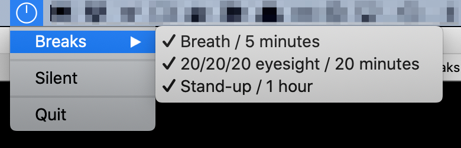

Multi-Breaks
=============

A Simple MacOS Application to set-up multiple reminders to improve your health.



## Features:

- 20/20/20 Reminders
- Drinking Water Reminders

## Dependencies:

- python3
- rumps

## Create Application Package:

```
$ make package
```

## Development

Setup virtual environment

```
$ make setup
```

Run application
```
$ make run
```

