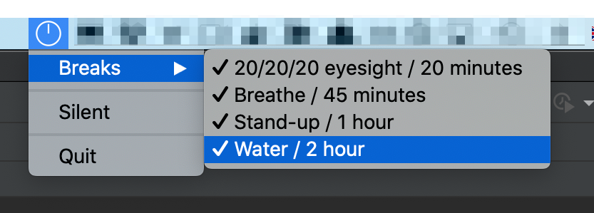

Multi-Breaks
=============

[](https://github.com/namuan/multi-breaks/releases/latest) [](https://github.com/namuan/multi-breaks/blob/master/LICENSE) [](https://twitter.com/deskriders_twt)

A Simple MacOS Application to set-up multiple reminders to improve your health.



## Features:

- Mindful Breathing Reminders every 45 minutes
- 20/20/20 Eyesight Reminders every 20 minutes
- Stand-up and Walk Reminders every 1 hour
- Drinking Water Reminders every 2 hours

## Dependencies:

- python3
- rumps

## Create Application Package:

```
$ make package
```

## Development

Setup virtual environment

```
$ make setup
```

Run application
```
$ make run
```

